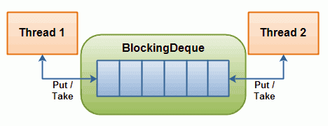
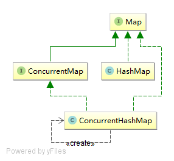
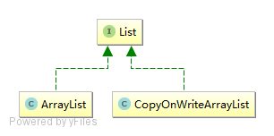
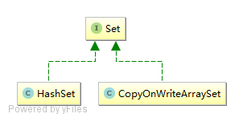

# Java - Concurrent 并发工具包

> 参考Jakob Jenkov的[java.util.concurrent](http://tutorials.jenkov.com/java-util-concurrent/index.html)

## 原子化数据类型

- AtomicBoolean
- AtomicInteger
- AtomicLong
- AtomicReference
- AtomicMarkableReference
- AtomicStampedReference
- AtomicIntegerArray
- AtomicLongArray
- AtomicReferenceArray

## 阻塞队列

代表一个线程安全的队列，通常用于一个线程放入对象，另一个线程取出对象。


- 如果这个阻塞队列达到容量上限，生产线程再尝试放入新的对象时会被阻塞，直到消费线程从队列中取出对象
- 如果消费线程尝试从一个空的队列中取出对象，它会被阻塞，直到生产线程向队列中放入对象

### BlockingQueue实现类

#### ArrayBlockingQueue

- 内部通过一个数组存储对象的
- 实例化时必须指定容量大小
- 存储对象遵循FIFO（先进先出）顺序

#### DelayQueue

- 内部会阻塞元素，直到一个确定的延迟过期（零或负数）
- 队列里的对象必须实现`java.util.concurrent.Delayed`接口
- 实现`Delayed.getDelay`方法，自定义延迟的规则
- 实现`Delayed.compareTo`方法，自定义队列的排序规则

#### LinkedBlockingQueue

- 内部通过一个链式结构存储对象的
- 可以设置容量大小，也可以不设置。如果不设置，最大为`Integer.MAX_VALUE`
- 存储对象遵循FIFO（先进先出）顺序

#### PriorityBlockingQueue*

- 队列里的对象必须实现`java.lang.Comparable`接口
- 实现`Comparable.compareTo`方法，自定义队列的排序规则

#### SynchronousQueue

- 只能容纳一个对象

## 阻塞双端队列

代表一个线程安全的队列，通常用于一个线程放入对象，另一个线程取出对象。可以对队列的两端执行操作。



- 如果这个阻塞队列达到容量上限，生产线程再尝试放入新的对象时会被阻塞，直到消费线程从队列中取出对象
- 如果消费线程尝试从一个空的队列中取出对象，它会被阻塞，直到生产线程向队列中放入对象
- 生产线程允许在队列两端插入
- 消费线程允许从队列两端取出

Operation     | Throw Exception | Special Value | Block        | Timeout
--------------| ---------------- | ------------- | ------------ | ------
Insert First  | addFirst(o)      | offerFirst(o) | putFirst(o)  | offerFirst(o, timeout, timeunit)
Remove First  | removeFirst(o)   | pollFirst(o)  | takeFirst(o) | pollFirst(timeout, timeunit)
Examine First | getFirst         | peekFirst(o)  |              |
Insert Last   | addLast(o)       | offerLast(o)  | putLast(o)   | offerLast(o, timeout, timeunit)
Remove Last   | removeLast(o)    | pollLast(o)   | takeLast(o)  | pollLast(timeout, timeunit)
Examine Last  | getLast          | peekLast(o)   |              |

- Throw Exception 如果企图的操作不可能立即完成，那么会抛出一个异常。
- Special Value 如果企图的操作不可能立即完成，那么会返回一个特殊的值（通常是true/false/null）。
- Block 如果企图的操作不可能立即完成，这个方法会阻塞，直到可以继续进行。
- Times Out 如果企图的操作不可能立即完成，这个方法会阻塞，但是阻塞的时间最长不会超过指定的timeout值，达到timeout后会返回一个特殊的值（通常是true/false/null）来告诉你操作是否成功。

### BlockingDeque 实现类

#### LinkedBlockingDeque

## 集合

#### ConcurrentMap



继承`java.util.Map`接口，新增`putIfAbsent()`、`replace()`、`remove()`等方法。

线程安全的实现类：

- ConcurrentHashMap
- ConcurrentNavigableMap

#### CopyOnWriteArrayList



#### CopyOnWriteArraySet



## 执行器

ExecutorService接口代表了一种异步执行机制，可以在后台执行任务。使用线程池实现。


### 创建ExecutorService

可以使用`java.util.concurrent.Executors`工厂类快速创建。

```java
// 创建ExecutorService实例
ExecutorService executor1 = Executors.newSingleThreadExecutor();
ExecutorService executor2 = Executors.newFixedThreadPool(10);

// 创建ScheduledExecutorService实例
ScheduledExecutorService executor3 = Executors.newSingleThreadScheduledExecutor();
ScheduledExecutorService executor4 = Executors.newScheduledThreadPool(10);
```

### 关闭ExecutorService

当你使用完`ExecutorService`后，应该使用`shutdown()`方法关闭它，这样线程就不会继续运行了。`ExecutorService`并不会立即关闭，但是它也不会再接收新任务，当所有的线程完成了它们的任务后`ExecutorService`就会关闭。

如果你想立即结束`ExecutorService`，应该调用`shutdownNow()`方法，但是这个并没有保障，也许它们会停止也许会执行完。

### ExecutorService实现类

#### ThreadPoolExecutor

内部维护着一个线程池，可以执行给定的任务。

```java
/**
 * @param corePoolSize 线程池维护线程的最少数量
 * @param maximumPoolSize 线程池维护线程的最大数量
 * @param keepAliveTime 线程池维护线程所允许的空闲时间
 * @param unit 线程池维护线程所允许的空闲时间的单位
 * @param workQueue 线程池所使用的缓冲队列
 * @param threadFactory 创建线程的工厂
 * @param handler 线程池对拒绝任务的处理策略
 */
public ThreadPoolExecutor(int corePoolSize,
                          int maximumPoolSize,
                          long keepAliveTime,
                          TimeUnit unit,
                          BlockingQueue<Runnable> workQueue,
                          ThreadFactory threadFactory,
                          RejectedExecutionHandler handler) {}
```

- `void execute(runnable)`
- `Feture submit(runnable)`
- `Feture submit(callable)`
- `T invokeAny(callables)`
- `List<Feture> invokeAll(callables)`

#### ScheduledThreadPoolExecutor

继承自ThreadPoolExecutor类，实现了ScheduledExecutorService接口，主要用于延迟执行、定时执行。

```java
/**
 * @param corePoolSize 线程池维护线程的最少数量
 * @param threadFactory 创建线程的工厂
 * @param handler 线程池对拒绝任务的处理策略
 */
public ScheduledThreadPoolExecutor(int corePoolSize,
                                   ThreadFactory threadFactory,
                                   RejectedExecutionHandler handler) {}
```

- `ScheduledFuture schedule(runnable, delay, unit)`
- `ScheduledFuture schedule(callable, delay, unit)`

#### ForkJoinPool

使用分治法来解决问题。

```java
/**
 * @param parallelism 
 * @param threadFactory 
 * @param handler 
 * @param asyncMode 
 */
public ForkJoinPool(int parallelism,
                    ForkJoinWorkerThreadFactory threadFactory,
                    UncaughtExceptionHandler handler,
                    boolean asyncMode) {}
```

- `T invoke(task)`

## Lock锁

#### Lock互斥锁

一个可重入的互斥锁。

实现类：

- ReentrantLock

#### ReadWriteLock读写锁

实现类：

- ReentrantReadWriteLock

## Operation操作

#### CountDownLatch闭锁

允许一个或多个线程等待其他线程完成操作后再执行。

适用于一组线程和另一个主线程之间的工作协作。一个主线程等待一组工作线程的任务完毕才继续它的执行。

有`Waiter`，`Decrementer`两个线程，`Waiter`必须等`Decrementer`内的所有操作完成才能继续往下执行。

```java
static class Waiter implements Runnable {

    private CountDownLatch latch = null;

    public Waiter(CountDownLatch latch) {
        this.latch = latch;
    }

    public void run() {
        try {
            System.out.println("Lock Waiter");
            latch.await();
        } catch (InterruptedException e) {
            e.printStackTrace();
        }
        System.out.println("Waiter Released");
    }
}
```

```java
static class Decrementer implements Runnable {

    private CountDownLatch latch = null;

    public Decrementer(CountDownLatch latch) {
        this.latch = latch;
    }

    public void run() {
        try {
            Thread.sleep(1000);
            System.out.println("Decrementer Down 1");
            latch.countDown();

            Thread.sleep(1000);
            System.out.println("Decrementer Down 2");
            latch.countDown();

            Thread.sleep(1000);
            System.out.println("Decrementer Down 3");
            latch.countDown();
        } catch (InterruptedException e) {
            e.printStackTrace();
        }
    }
}
```

```java
public static void main(String[] args) throws Exception {
    CountDownLatch latch = new CountDownLatch(3);

    Waiter waiter = new Waiter(latch);
    Decrementer decrementer = new Decrementer(latch);

    new Thread(waiter).start();
    new Thread(decrementer).start();

    Thread.sleep(4000);
}
```

#### CyclicBarrier栅栏

可以堵住线程的执行，直到所有线程就绪。

适用于一组线程需要在特定事件上达成一致。它可以接受Runnable参数，被释放时执行。

当两个`Waiter`就绪后，才继续往下执行。

```java
static class Waiter implements Runnable {

    private CyclicBarrier barrier = null;
    private String name = null;
    private long delay = 0L;


    public Waiter(CyclicBarrier barrier, String name, long delay) {
        this.barrier = barrier;
        this.name = name;
        this.delay = delay;
    }

    public void run() {
        try {
            System.out.println("Lock Waiter " + name);
            Thread.sleep(delay);
            barrier.await();
        } catch (InterruptedException e) {
            e.printStackTrace();
        } catch (BrokenBarrierException e) {
            e.printStackTrace();
        }
        System.out.println("Waiter Released " + name);
    }
}
```

```java
public static void main(String[] args) throws Exception {
    CyclicBarrier barrier = new CyclicBarrier(3);

    Waiter waiter1 = new Waiter(barrier, "lily", 3000L);
    Waiter waiter2 = new Waiter(barrier, "lucy", 2000L);

    new Thread(waiter1).start();
    new Thread(waiter1).start();

    Thread.sleep(4000);
}
```

#### Semaphore信号量

通过构造函数设定一个数量的许可，然后通过 acquire 方法获得许可，release 方法释放许可。

```java
public static void main(String[] args) {
    final Semaphore available = new Semaphore(3);
    final Random rand = new Random();
    for (int i = 0; i < 10; i++) {
        new Thread(new Runnable() {
            @Override
            public void run() {
                int time = rand.nextInt(15);
                try {
                    available.acquire();
                    System.out.println("Executing  long-running action for " + time + " seconds... #" + Thread.currentThread().getName());

                    Thread.sleep(time * 1000);

                    System.out.println("Done with #" + Thread.currentThread().getName() + "!");
                    available.release();
                } catch (InterruptedException e) {
                }
            }
        }).start();
    }
}
```

#### CountDownLatch、CyclicBarrier、Semaphore比较

CountDownLatch 是能使一组线程等另一组线程都跑完了再继续跑；

CyclicBarrier 能够使一组线程在一个时间点上达到同步，可以是一起开始执行全部任务或者一部分任务。同时，它是可以循环使用的；

Semaphore 是只允许一定数量的线程同时执行一段任务。

#### Exchanger交换器

两个线程之间交换数据。

Lily、lucy两个线程交换礼物。

```java
static class Lily implements Runnable {

    private Exchanger<String> exchanger = null;
    private String gift = null;

    public Lily(Exchanger<String> exchanger, String gift) {
        this.exchanger = exchanger;
        this.gift = gift;
    }

    @Override
    public void run() {
        try {
            Thread.sleep(1000);
            gift = exchanger.exchange(gift);
            System.out.println("lily exchange gift: " + gift);
        } catch (Exception e) {
            e.printStackTrace();
        }
    }
}
```

```java
static class Lucy implements Runnable {

    private Exchanger<String> exchanger = null;
    private String gift = null;

    public Lucy(Exchanger<String> exchanger, String gift) {
        this.exchanger = exchanger;
        this.gift = gift;
    }

    @Override
    public void run() {
        try {
            gift = exchanger.exchange(gift);
            System.out.println("lucy exchange gift: " + gift);
            Thread.sleep(1000);
        } catch (Exception e) {
            e.printStackTrace();
        }
    }
}
```

```java
public static void main(String[] args) throws Exception {
    Exchanger<String> exchanger = new Exchanger<>();

    new Thread(new Lily(exchanger, "apple")).start();
    new Thread(new Lucy(exchanger, "pear")).start();

    Thread.sleep(3000);
}
```

*PS：本文使用的是java-1.8*