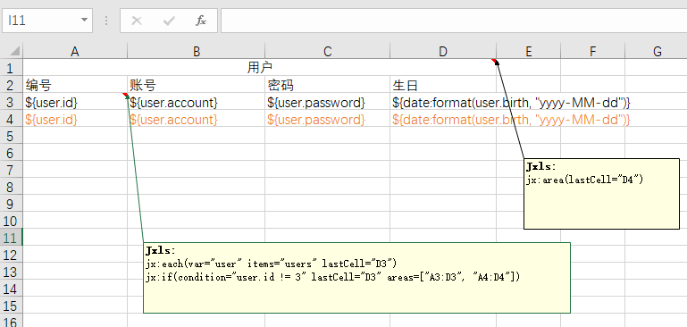

# Java - Jxls生成Excel报表

> [Jxls](http://jxls.sourceforge.net)是一个生成Excel的工具包。它采用[Apache Jexl](http://commons.apache.org/proper/commons-jexl/reference/syntax.html)标签的方法，类似Jsp标签，写一个Excel模板，然后生成报表，非常灵活，简单。

先看一下Excel模板模板吧。


- A1单元格中的批注 `jx:area(lastCell="C3")` 表示模板的区域为A1:C3，在这区域内的标签才会被解析。
- A3单元格中的批注 `jx:each(var="user" items="users" lastCell="C3")` 用于遍历一个列表 `users` ，lastCell表示遍历的区域为A3:C3。

接下来再看看Jxls是怎么使用这个模板文件吧。

```java
public class JxlsTest {
    @Test
    public void test() throws Exception {
        List<User> users = listUser();
        try (InputStream input = new FileInputStream(getTemplate("user.xlsx"))) {
            try (OutputStream output = new FileOutputStream(getOutput("user.xlsx"))) {
                Context context = new Context();
                context.putVar("users", users);
                JxlsHelper.getInstance().processTemplate(input, output, context);
            }
        }
    }
    ...
}
```
 
 最后我再介绍下Jxls是怎么自定义标签函数。
 
 
 
- A3单元格中的批注 `jx:if(condition="user.id != 3" lastCell="C3" areas=["A3:D3", "A4:D4"])` 表示满足 `condition` 条件的数据使用 `A3:D3` 获取数据，否则使用 `A4:D4`。
- D4单元格中的标签 `${date:format(user.birth, "yyyy-MM-dd")}` 表示调用 `date` 域中的 `format` 方法。

```java
public class JexlDateFunction {
    public static final String definition = "date";
    public String format(Date date, String pattern) {
        if (date == null)
            return null;
        if (pattern == null)
            pattern = "yyyy-MM-dd HH:mm:ss";
        DateFormat dateFormat = new SimpleDateFormat(pattern);
        return dateFormat.format(date);
    }
}
public class JxlsUtil {
    public static Boolean export(InputStream input, OutputStream output, Map<String, Object> data) {
        try {
            JxlsHelper jxlsHelper = JxlsHelper.getInstance();
            Transformer transformer = jxlsHelper.createTransformer(input, output);
            JexlExpressionEvaluator evaluator = (JexlExpressionEvaluator) transformer.getTransformationConfig().getExpressionEvaluator();
            Map<String, Object> functions = new HashMap<>();
            functions.put(JexlDateFunction.definition, new JexlDateFunction());
            evaluator.getJexlEngine().setFunctions(functions);
            Context context = new Context();
            for (Map.Entry<String, Object> entry : data.entrySet())
                context.putVar(entry.getKey(), entry.getValue());
            jxlsHelper.processTemplate(context, transformer);
            return true;
        } catch (Exception e) {
            e.printStackTrace();
            return false;
        }
    }
}
public class JxlsUtilTest {
    @Test
    public void test() throws Exception {
        List<User> users = listUser();
        try (InputStream input = new FileInputStream(getTemplate("user-util.xlsx"))) {
            try (OutputStream output = new FileOutputStream(getOutput("user-util.xlsx"))) {
                Map<String, Object> data = new HashMap<>();
                data.put("users", users);
                JxlsUtil.export(input, output, data);
            }
        }
    }
    ...
}
```

*PS：本文使用的是jxls-2.4.0*